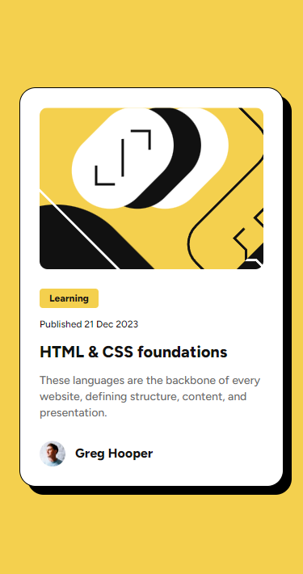

# Frontend Mentor - Blog preview card

Esta é uma solução para o [Blog preview card challenge on Frontend Mentor](https://www.frontendmentor.io/challenges/blog-preview-card-ckPaj01IcS) feito em
[Next.js](https://nextjs.org/) juntamente com [Tailwindcss](https://tailwindcss.com/).

## Começando

Clone o projeto:

```bash
git clone https://github.com/HigorSR/blog-preview-card.git
```

Entre no diretório do projeto:

```bash
  cd blog-preview-card
```

Instale as dependências:

```bash
  npm install
  # or
  yarn install
```

Inicie o servidor:

```bash
  npm run dev
  # or
  yarn dev
```

Abra http://localhost:3000 no seu navegador para ver o resultado.

## Screenshots

<div align="center">
  
</div>

## Stack utilizada

**Front-end:** Next.js, JavaScript, TailwindCSS.

